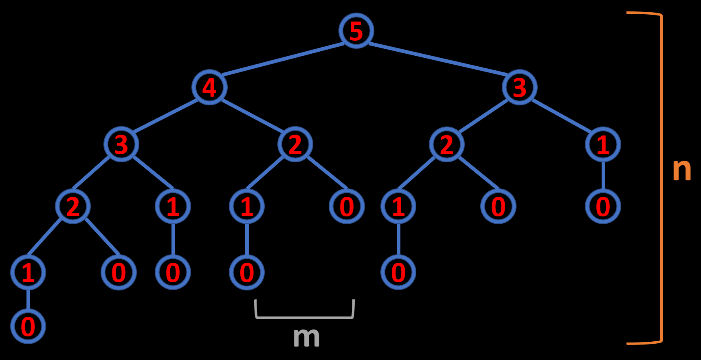

# Recursion Visualization
Recursion is a concept that is best understood through visualization. In this article, you will see visualizations for different kinds of recursions. For simplicity, I chose to animate recursive functions using trees. Properties of the recursion tree visualizations are:
* Each node represents a single recursive function call.
* The height of the recursion tree is the depth of our function call stack (n).
* The rate of change of the tree's width represents the time complexity of our function (m):



If you want to see the visualizations, dive right in.

Table of contents:
* [Resources](#resources)
* [Recursive Power Function Visualization](#power-function)
* [Recursive Fibonacci Calculation Visualization](#calculating-5th-fibonacci-number-using-recursion)
* [Recursive Fibonacci-like Sequence Calculation Visualization](#modified-fibonacci-sequence)
* [Conclusion](#conclusion)

## Resources
You can find the video version of this article on YouTube: [https://www.youtube.com/watch?v=mFb1Fj4sVcU](https://www.youtube.com/watch?v=mFb1Fj4sVcU){:target="_blank"}

<iframe width="560" height="315" src="https://www.youtube.com/embed/mFb1Fj4sVcU" frameborder="0" allow="accelerometer; autoplay; encrypted-media; gyroscope; picture-in-picture" allowfullscreen></iframe>

The video has all the illustrations along with the narrative. If you want to read the comments or leave a comment, do so under the YouTube video. If you want to contribute to the article, make a pull request on GitHub.

The [Recursion Visualization Tool](/tools/recursion-visualization){:target="_blank"} I used in this video.

[My "Staircase Problem + 3 Variants" article](/algorithms/dynamic-programming/staircase-problems){:target="_blank"}, which is a great real-world application of recursive solutions, as well as memoization and plain iteration.

## Power Function
What you see is the visualization of a "2 to the power of n" (2^n) function which is implemented using recursion:

<video width="1280" height="1012" controls><source src="media/power_of_2.mp4" type="video/mp4"></video>

The code is simple:

```python
def pow(x, n):
    if n == 1:
        return x
    return x * pow(x, n-1)
```

At each level, we multiply the result of the deeper recursive call with 2, hence calculating 2 raised to the power of n. A much better way of implementing this would be to use fast-power, but for demonstration sake, we will stick with recursion. As you saw in the animation, our call stack goes all the way down and then back up, bringing back the result from the deepest level. So, our call stack never bounces up and down. Let's switch to a Fibonacci example to investigate a recursion where the call stack depth increases and decreases along with where we are at the calculation.

## Calculating 5th Fibonacci Number Using Recursion
In this example, you are seeing the visualization of the calculation of 5th Fibonacci number using recursion:

<video width="1280" height="904" controls><source src="media/fibonacci_5.mp4" type="video/mp4"></video>

The formula for calculating Fibonacci numbers is straightforward. Every Fibonacci number is the sum of the previous two Fibonacci numbers. The code for the recursive calculation of Fibonacci numbers is also quite simple:

```python
def fib(n):
    if n <= 1:
        return n
    else:
        return fib(n-1) + fib(n-2)
```

Since all we do is to sum the previous two Fibonacci numbers at each step, the width of our recursion tree branches are restricted to two children. And the height of the recursion tree reaches a maximum of 5, which is our call stack depth. Modern programming runtimes allow call stack depths of hundreds of thousands so we could go a lot deeper, but it would take a lot of time due to the exponential complexity of our calculation:

```
Time Complexity: O(2^n)
Space Complexity: O(1)
Call Stack: O(n)
```

Now, why is the time complexity exponential. As you can see, at every level of the recursion tree, it gets wider by a factor of two. This means that every consecutive Fibonacci number will take double the amount of time to calculate. At least we don't create new variables per calculation, so our space complexity is constant. And as you just saw, our call stack only grows linearly.

## Modified Fibonacci Sequence
What if the Fibonacci numbers were the sum of the previous three Fibonacci numbers instead of two? How would our recursion tree look like? Let's find out:

<video width="1280" height="890" controls><source src="media/modified_fibonacci_5.mp4" type="video/mp4"></video>

As you can see, the only difference this time is the width of the recursion tree. Our height still maxes out at five, but the width of our recursion tree grows by a factor of three this time. This will again result in exponential time complexity, one that grows cubically.

## Conclusion
If you want to see an excellent example of recursion in programming interviews, check out my "Staircase Problems + 3 Variants" article. Solutions of staircase problems, and other unique paths problems, are Fibonacci-like sequences. In that article, I explain how to solve them using recursion, memoized recursion, and simple iteration. You can find the link to it in the resources section above. And if you want to see my other algorithms articles, check out the home page. Finally, the source for the visualization tool that I used is also in the resources section.
