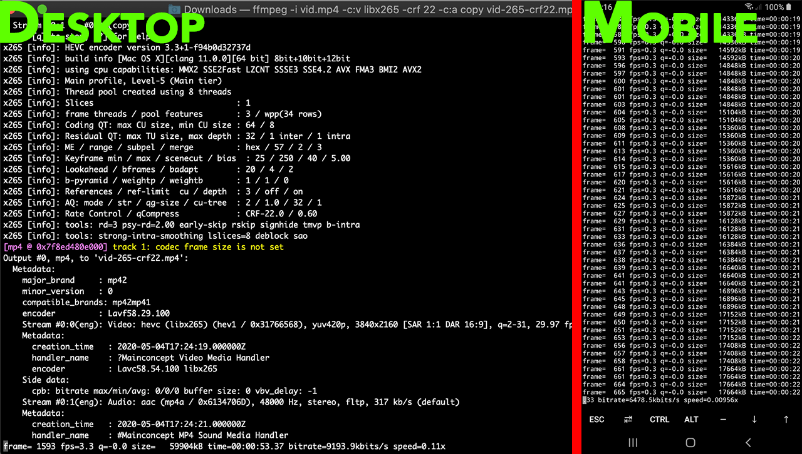

# How Fast is H.265/HEVC Software Encoding on ARM CPUs (iPhone/Android) With FFmpeg?
I recently had a crazy idea of using my idle mobile devices as a video render cluster. I have used the following FFmpeg command to compress a 4K H.264 footage to H.265 footage with a CRF (Constant Rate Factor) of 22, both on my Android phone and on my Mac:

* ffmpeg -i vid.mp4 -c:v libx265 -crf 22 -c:a copy vid-265-crf22.mp4

The command uses pure software encoding and is multi-threaded by default. Both on my phone and my computer, all the CPU cores were utilized above 95% during encoding. I have used Homebrew on my Mac to install the FFmpeg package, whereas on my Android, I have used Termux.

The speed difference between desktop and mobile encoding was astounding! In the article, you will discover why there is such a difference along with what the future holds for H.265 software encoding on mobile devices.

## Resources
You can find the video narration of this article on YouTube: [https://www.youtube.com/watch?v=UZCKD-zcrfU](https://www.youtube.com/watch?v=UZCKD-zcrfU){:target="_blank"}

<iframe width="560" height="315" src="https://www.youtube.com/embed/UZCKD-zcrfU" frameborder="0" allow="accelerometer; autoplay; encrypted-media; gyroscope; picture-in-picture" allowfullscreen></iframe>

Video has additional tips and illustrations. If you want to read the comments or leave a comment, do so under the YouTube video. If you want to contribute to the article, make a pull request on GitHub.

Relevant resources referred to in this article:
* [Discussion on Doom9 Forum about x265 encoding speed on ARM processors](https://forum.doom9.org/showthread.php?p=1817880#post1817880){:target="_blank"}
* [x265 Source Code](https://github.com/videolan/x265){:target="_blank"}
* [Nvidia NVENC hardware encoder quality test for H.264](https://www.youtube.com/watch?v=-fi9o2NyPaY){:target="_blank"}

# The Numbers

As I mentioned, I did the FFmpeg H.265 software encoding comparison between ARM and x86. The speed difference between my quad-core Intel i7 4850HQ 15" MacBook Pro and my 8-core Exynos 7885 Samsung phone was an astounding 1000%!
* 4-core Intel i7 4850HQ: ~3.3 fps @ 45 Watts
* 8-core Exynos 7885: ~0.31 fps @ 5 Watts

That is a 10-fold difference overall or 20-fold difference per core. The Intel CPU in my 15" MacBook Pro is rated for 45W TDP (Thermal Design Power), whereas my phone's ARM CPU is rated for a measly 5W. There is a 9-fold difference in the thermal envelope of these CPUs, so that must explain the massive difference in performance, right? Not really. If we check out the Geekbench score for these two CPUs, the difference is only 3.5-fold:
* 4-core Intel i7 4850HQ: 3463 (Multi-Core)
* 8-core Exynos 7885: 1010 (Multi-Core)

This is very much in line with my expectations. I would expect ARM CPUs to be substantially more power-efficient than desktop processors. So, seeing an ARM processor be about 2.5-times more power-efficient per Geekbench score is perfectly normal to me.
* 4-core Intel i7 4850HQ: 77 Geekbench Score / Watt
* 8-core Exynos 7885: 202 Geekbench Score / Watt

So why is the H.265 encoding with FFmpeg 10-times slower on an ARM processor? According to my research, the x265 library used by FFmpeg is not well optimized for ARM yet. Quoting directly from the official x265 project's response on a discussion on this topic in Doom9 Forums:

> "We have some limited ARM Neon optimization (x265\source\common\arm), but this is not anywhere near as complete as our x86 SIMD optimization. We have had discussions with various people at various times about doing a full optimization effort, but as of today this has not bubbled up to the top of the priority list for our customers or our strategic hardware partners. Of course, x265 is open source, and contributions are always welcomed."

I went ahead and checked the x265 project's source code on GitHub and seen that ARM code is very rarely updated whereas the x86 code is much more frequently maintained. It is safe to assume that H.265 software encoding performance on ARM devices like phones and tablets will not improve anytime soon. It might be possible to use the hardware encoders found on these devices to accelerate H.265 encoding massively. However, hardware encoders generally perform worse than software encoders in terms of quality, and they do not offer a rich selection of parameters that you can use with the software encoder. For instance, I do not know of any H.265 encoder that supports Constant Rate Factor yet, which is my go-to encoding mode.

# Conclusion
If you want to use your spare Android or iPhone for H.265 video encoding, forget about it! It is painstakingly slow. I am back to leaving my laptop on during nights for rendering. However, I have recently read that the latest generation of Nvidia cards delivers excellent H.264 quality with their NVENC hardware encoder. If you want to check out the quality analysis video, the link is in the resources section above. If I decide to build a desktop render machine with Nvidia hardware, I will test it on H.265 and let you guys know.
