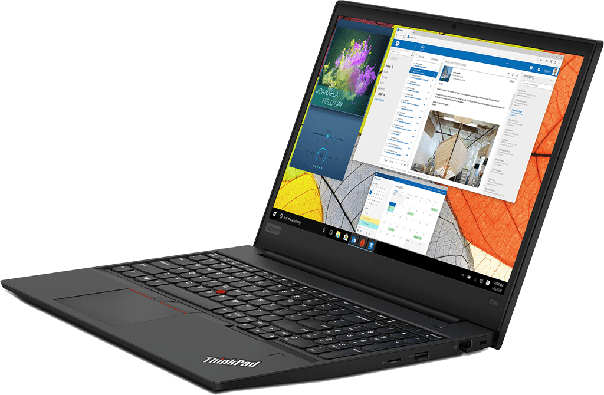
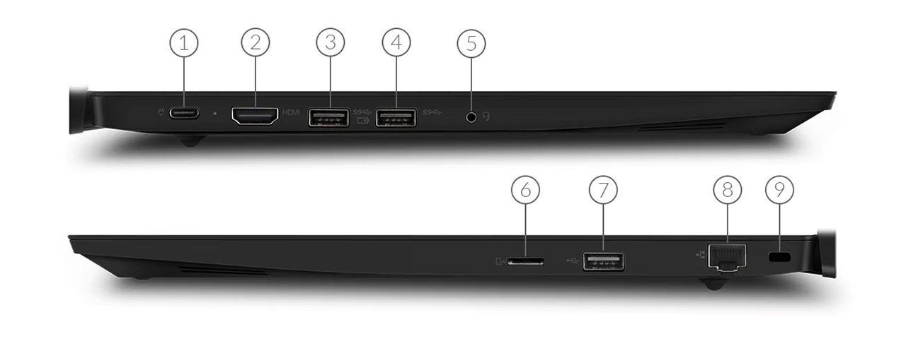

# How to Get a Great Linux Laptop at a Perfect Price - Lenovo ThinkPad Without a Pre-installed OS
Today I am going to give you a quick guide on how to get a great Linux laptop at a perfect price. In my experience, Lenovo ThinkPad laptops are one of the least problematic laptop series with Linux, so I will focus on them. ThinkPads with AMD Ryzen CPUs sell for roughly $200 less than their Intel competitors while offering better performance. In addition, you can get a ThinkPad T or E series laptop without the pre-installed Windows, which will save you another $100. I used to recommend the T series above anything, but these days they offer very little over the E series.

## Note for Future ThinkPad Releases
Even though I use ThinkPad E595 as an example in this article, new ThinkPads with newer AMD Ryzen CPUs will be out nearly every year. For future laptop releases, you can apply the same technique that I will be demonstrating here and get the same sweet deals. As of writing this note (Sep-2020), ThinkPad E15/E14 and T15/T14 are partially available, so you can try your luck with them. This guide might also work with non E/T series laptops. If you want to check the Linux compatibility of future models, I have the link to the compatibility table in the next section.

## Resources
You can find the video narration of this article on YouTube: [https://www.youtube.com/watch?v=9Wx1fM_oWH8](https://www.youtube.com/watch?v=9Wx1fM_oWH8){:target="_blank"}

<iframe width="560" height="315" src="https://www.youtube.com/embed/9Wx1fM_oWH8" frameborder="0" allow="accelerometer; autoplay; encrypted-media; gyroscope; picture-in-picture" allowfullscreen></iframe>

Video has live instructions for this guide. If you want to read the comments or leave a comment, do so under YouTube video. If you want to contribute to the article, make a pull request on GitHub.

Lenovo affiliate link which you can use in your purchase to help out the QuanticDev website:
* [https://lenovo.7eer.net/A97BN](https://lenovo.7eer.net/A97BN){:target="_blank"}

If you want to check the Linux compatibility of future Lenovo laptops, below is the compatibility table:
* [https://wiki.archlinux.org/index.php/Laptop/Lenovo#E_series](https://wiki.archlinux.org/index.php/Laptop/Lenovo#E_series){:target="_blank"}

My [Cleanest Linux Productivity and Development Environment using Manjaro Linux](/articles/manjaro-linux-productivity-machine){:target="_blank"} article which can help you set up your shiny new laptop.

## Lenovo ThinkPad E595 (E Series)
For this guide we will buy a Lenovo ThinkPad E595, so let's start by checking it out. The ThinkPad E595 has acceptable bezels on its great IPS display and a passable 720p webcam on the top bezel. The 45Wh battery should last you for 6-7 hours of coding. (Note that E15 is the successor to E595, and it will become available in August 2020, so you might try that instead.)

It is charged through the USB-C port with a USB-C charger, has HDMI, Ethernet socket, and a MicroSD slot. It does not have a dedicated graphics card, which means more power efficiency and fewer problems with Linux. Ryzen's integrated Vega graphics is quite adequate anyway. Even the video editing software started utilizing the integrated Vega graphics card to accelerate editing and rendering.

Now let's jump in and buy one of these guys.

# Purchase Guide
Start by going to the Lenovo website at lenovo.com, or using my affiliate link in the resources section above, in case you want to help quanticdev.com. Once the website loads, scroll all the way down and select your country from the dropdown on the bottom right. After that, click on "Laptops" from the top navigation menu. On the new page, look for E595. If you want an identical 14" laptop, you can go with the E495, but for productivity, I recommend E595 for its bigger screen. Once you click on E595's thumbnail, you will see that it also has Intel counterpart, but we want the AMD one, so make sure that AMD is selected. Click on **"Show All"** to see all the pre-configured models. From the models list, click on the **cheapest one on the left with the Ryzen 3 CPU**. This step is important because only the cheapest one offers the option to purchase without the pre-installed Windows. Do not worry though, we will beef up its configuration after the selection. So, the cheapest base model currently is **$453** (US Dollars without VAT). Click on **"Customize & Buy"**, and you will be taken to the component configuration page.

**Note**: If you want to see me doing all these for you live, check out the YouTube video in the resources section above.

The first thing to do on the configuration page is to select the **Ryzen 5** option. It has double the cores of Ryzen 3 and a better integrated GPU. You can also go with **Ryzen 7** if you have the budget or the need for speed. However, this is a laptop in the end, so you are guaranteed to be thermally throttled at some point, so you will start to get diminishing returns as you go higher on the core count. Below the CPU selection, you will see the Operation System selection box. Windows 10 Home is selected by default, but we do not want it. Select **"No Operating System"**, and you will instantly **save $100**. After that, scroll down and select your memory. You can go with **16 GB or 32 GB** depending on the tools you will use. Remember, Linux is very memory efficient, but apps you will use might not be.

Now scroll down a bit and deselect the 1 TB 5400 RPM spinning disk from the storage options. I recommend avoiding spinning disks, but if you have some large files that you want to store on a slower disk, you can leave it selected. Or you can add a larger capacity disk to that slot later when you need it. Just make sure that the dimensions of the 3rd party disk that you are planning to use are correct for your laptop. Scroll down again, and you will see the second hard-drive option. The default selected one is a 128 GB M.2 SSD. Change that to the **512 GB or 1 TB** one so you will have ample fast storage for all your apps. Finally, you can change your keyboard layout to a different language. And that is it. Rest of the configuration is greyed-out by default. Add your new laptop to your cart, and you will see that it adds up to $507 (without VAT). It is probably the best machine you can get at this price and quality for a Linux compatible machine. Since the price is so low, Lenovo will not let you put in any discount coupons. But if you are a student, you can go to the **Laptops > Student Discount** section from the top menu. If you have a .edu email address, you can get a 20% discount from that price. Isn't being a student a great thing now (no, it is not!).

### Tip
I have a dedicated article on how to setup a clean **Linux productivity and development environment using Manjaro Linux**. It is a 10-minute guide that takes you from installing Linux for the first time on your new laptop to developing a React app with your shiny new Linux tools. If you want to read it, the link is in the resources section above.

## Conclusion
Don't forget, whenever a next generation of ThinkPads with newer AMD Ryzen processors come out, you can always apply the same technique. If you want to check the Linux compatibility of future models, I have the link to the compatibility table in the resources section above. In addition, I will leave an affiliate link to the Lenovo ThinkPad website in the resources section. If you want to support quanticdev, you can use it in your purchase, and the website will get a small percentage of the sale. Finally, if you know someone who needs a great Linux laptop for an amazing price, share this guide with them.
