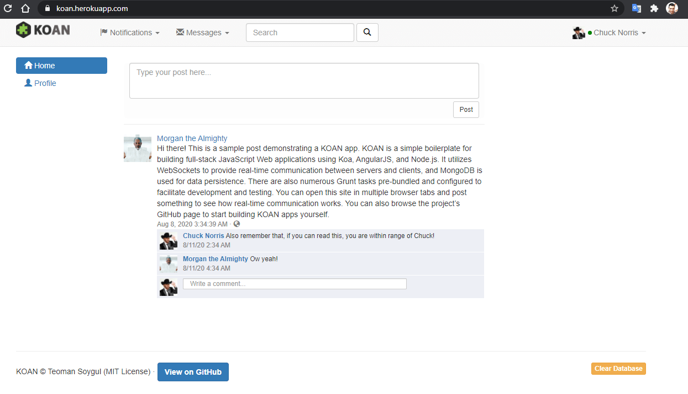
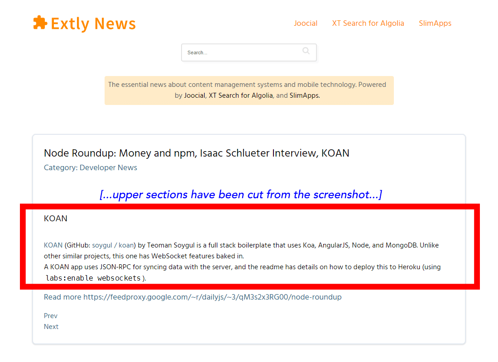
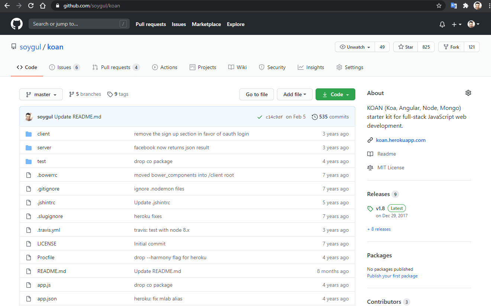
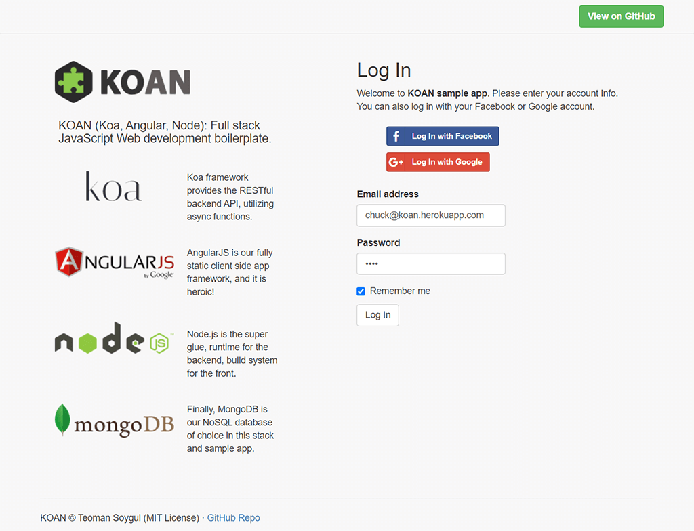
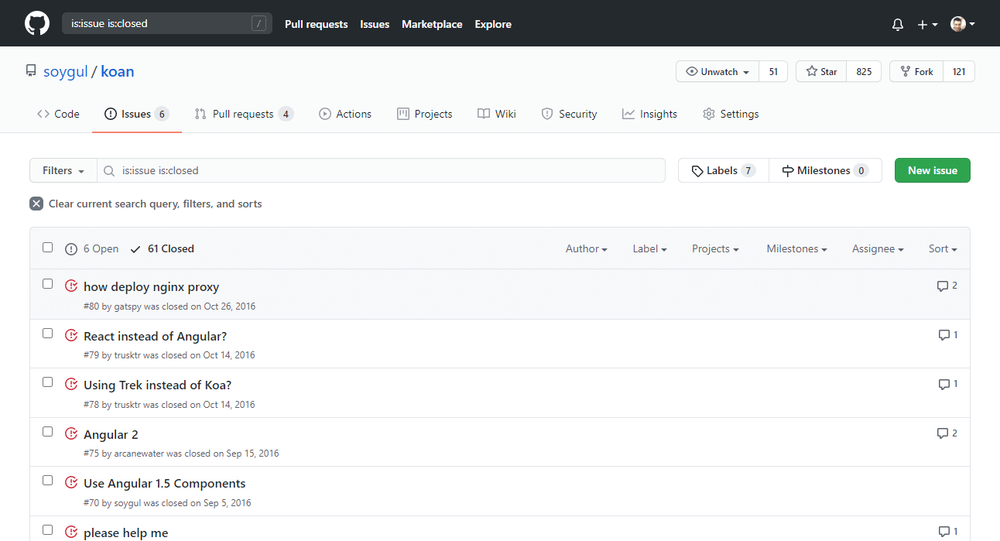

# My Project Got 800 Stars in Two Days on GitHub - KOAN (Open-Source)
In this article, you will discover how my open-source JavaScript project got 800 stars on GitHub within two days of publishing it. My project is called KOAN (github.com/soygul/koan), and I created it to preserve my general knowledge in Koa and Angular frameworks, as well as Node.js and MongoDB, by making a ready-to-use project template. Upon submitting it to a couple of JavaScript newsletters for review, it exploded and got 800 stars in its first two days of existence! So how did this happen? Did I get lucky? Or did I build something special that people wanted or needed? Or did I simply game the GitHub? Well, read on.

Table of contents:
* [Resources](#resources)
* [KOAN Project](#koan-project)
* [KOAN Demonstration](#koan-demonstration)
* [How to Get Starts on GitHub Then?](#how-to-get-starts-on-github-then)
* [Conclusion](#conclusion)

## Resources
You can find the video version of this article on YouTube: [https://www.youtube.com/watch?v=vOQyo64WBAA](https://www.youtube.com/watch?v=vOQyo64WBAA){:target="_blank"}{:rel="noopener"}

<iframe width="560" height="315" src="https://www.youtube.com/embed/vOQyo64WBAA" frameborder="0" allow="accelerometer; autoplay; encrypted-media; gyroscope; picture-in-picture" allowfullscreen></iframe>

Video has live demonstration of my project KOAN. If you want to read the comments or leave a comment, do so under the YouTube video. If you want to contribute to the article, make a pull request on GitHub.

My open-source project KOAN that is the focus of this video:
* [https://github.com/soygul/koan](https://github.com/soygul/koan){:target="_blank"}{:rel="noopener"} (source code)
* [https://koan.herokuapp.com](https://koan.herokuapp.com){:target="_blank"}{:rel="noopener"} (demo page)

JavaScript Newsletter Issue that featured my project:
* [https://news.extly.com/more-news/2022-joomla-developer/developer-news/11859-node-roundup-money-and-npm-isaac-schlueter-interview-koan.html](https://news.extly.com/more-news/2022-joomla-developer/developer-news/11859-node-roundup-money-and-npm-isaac-schlueter-interview-koan.html){:target="_blank"}{:rel="noopener"}

Relevant articles referred to in this article:
* My [How to Correctly Use GitHub for Software Development - My Full Workflow With Tutorial](/articles/how-to-use-github){:target="_blank"}{:rel="noopener"} guide. It can help you get in the zone to create similar successful projects.
* My [How to Find Funding for Your Project](/articles/how-to-fund-your-project){:target="_blank"}{:rel="noopener"} guide, which can help you to find funding in developing your open-source projects into a commercial product.

## KOAN Project
First things first. My project, KOAN, is a full-stack web framework template which you can use as a starting point for your JavaScript web apps. On the backend, it uses Koa framework plus Node.js and MongoDB. On the frontend, it uses Angular and WebSockets for real-time interactions between logged-in users.

A web app boilerplate with built-in WebSocket support is what got the attention of JavaScript newsletters in the first place. Also, few open-source projects offer a complete working sample of their projects, so creating a Facebook clone with KOAN was a great demonstration of its capabilities.

## KOAN Demonstration
Now let me demonstrate the project to you, and then we can investigate why it was successful. Let's start with the KOAN's GitHub project page. It is an open-source project with the MIT license. It is a 7-year-old project, and I didn't update it much in the last five years, so it has been losing stars since then, almost back to day 2!

If we check out the README file, you can see that it is very clean and well structured. It starts with introducing the technology stack, continues with the live example and getting started instructions. Getting started is easy, you clone the repo, do `npm install && npm start`, and you have a basic working Facebook clone on your computer.

You can see that I even have a "Deploy to Heroku" button for one-click sample deployments of this project for people who want a quick start. Finally, the readme provides the rest of the configuration, testing, and licensing information. If you check out the source code, you can see that it is equally well documented. As a wise man once said, [code comments should tell you the why, and the code itself should tell you how](https://blog.codinghorror.com/code-tells-you-how-comments-tell-you-why/){:target="_blank"}{:rel="noopener"}.

**Note: Following section is the excerpt from the video demonstration. You can find the link to it in the resources section above.**

Now let's go ahead and check the live sample. You can see that I created a Facebook clone as an example usage of KOAN template. Yet again, the very first page of the demo website starts by introducing the project: "KOAN (Koa, Angular, Node): Full-stack JavaScript Web development boilerplate.". It also introduces the technology stack:

* Koa framework provides the RESTful backend API, utilizing async functions.
* Angular is our fully static client-side app framework, and it is heroic!
* Node.js is the superglue, runtime for the backend, build system for the front.
* Finally, MongoDB is our NoSQL database of choice in this stack and sample app.

Let's log in and see how it goes. Default credentials are pre-filled, so I will just use them. Logins with other social accounts is a feature that I implemented as a bonus. After login, you can see that it is a clone of Facebook in its early days. You can type comments or create new posts. You can also check your profile page, notifications, and messages. Remember when I said that the project was using WebSockets. The green dot near your name indicates that you are connected to the Node.js backend using a WebSocket connection. Let me open another window and log in as another user. When I submit a comment on one tab, it appears on the other in real-time, thanks to the persistent WebSocket connection to the backend. I won't go into the details, but this very basic feature alone made this project very valuable to many starters who are looking to implement a real-time web app with WebSockets.

By the way, if you are interested, I have an entire article demonstrating my open-source project workflow using Git, GitHub, and Docker. You can find the link to it in the resources section.

## How to Get Starts on GitHub Then?
Now you have seen a successful project with a successful execution, which resulted in a ton of recognition (and stars, forks etc.) on GitHub. So how did this all get together? Let me summarize it:

* Create something useful. There is a very fine line between working on something genuinely useful versus an unrealistic and unattainable goal. Use your best intuition to create something that will help people, do your market research, look for things that you need in your daily life. Don't just depend on wishful thinking.
* Build your project on top of best frameworks and tools. I built KOAN using Koa Framework, Angular, Node.js, and MongoDB. The reason why I built KOAN on top of these tools was that they were the best tools for the business at the time. On top of that, they were trending tools with strong userbase growth, so I was sure of their future success (and I was right!). The success of the tools that I used also contributed to the success of KOAN.
* Present your project as best as possible. As you have just seen, KOAN has a great live demonstration. The live example being a Facebook clone helps you compare it to Facebook directly, and demonstrates what you can do with it. The project also has very clean and concise documentation, along with fully commented source code.
* Introduce your project with a well-organized README file at your project's home. A good README on GitHub is generally in the following format:
  * Introduce the project.
  * Introduce the technology.
  * Link to live example(s) and screenshots.
  * Quickstart guide.
  * Configuration/parameters section.
  * Testing section.
  * Credits/licensing.
* Pour your previous experiences into the project. The reason as to why KOAN is so clean both in presentation and code is that I have created many web apps using similar tools. I finally decided to assemble a single master template project for my future work with all the experiences that I had up to that moment. Hence, I created KOAN.
* Eat your own dog food. I've used KOAN in many projects, including in my current startup. Every time I used KOAN for a new project, I've improved a part of it and backported patches from the new project back into KOAN. Keep improving your project, especially if you want to reuse it in your future work.
* Be attentive to bug reports and feature requests. I've resolved most issues reported on GitHub in less than a day. I've also reviewed most pull-requests pretty much instantly, created a backlog of features that can be implemented in the future, and closed the unrealistic feature requests. A clean backlog clearly demonstrates to onlookers that the project is well maintained and is dependable.
* 
* Being the best option on the market helps. This one is subjective, but when I created KOAN, there was no other high-quality and complete project template like it. None of the alternatives come with a full-on demonstration, and instant-deploy options like KOAN did. Nor did any other project's documentation compared to the clean and concise documentation of KOAN.
* Being the first to market helps. KOAN was one of the first web app project templates to come with built-in WebSocket support. This is also what got JavaScript newsletters interested in the first place.
* Finally, submit your creation for reviews. Contact newsletters, ping people on Twitter, submit it to relevant sub-Reddits. However, don't be pushy. Let the people decide for themselves.
* 
* You might eventually try and turn your project into a commercial success. Open-source or not, you always have great options for financing from government institutions to crowdfunding. If you want to learn about all kinds of financing options to help you with bringing your dream to life, check out my dedicated article on how to find funding for your projects. As usual, the link to it is in the resources section above.

## Conclusion
Don't forget that the primary objective of open-sourcing software is to be useful to the open-source community. The recognition (stars etc.) that comes with it is just a bonus. When the community starts using your software, they will begin to contribute back, which will benefit you in return, and everybody else. Take being useful as your goal, and you will get recognition eventually. Just like this article! If you found this article useful, share it with someone who you think might also find it useful. I will showcase more of my successful software projects in the future. If you want to see them, follow me on my socials. If you have a project that you want me to check out, let me know. I will review them and maybe even feature them in upcoming articles. And that is it for this writeup, I will see you on the next one.
