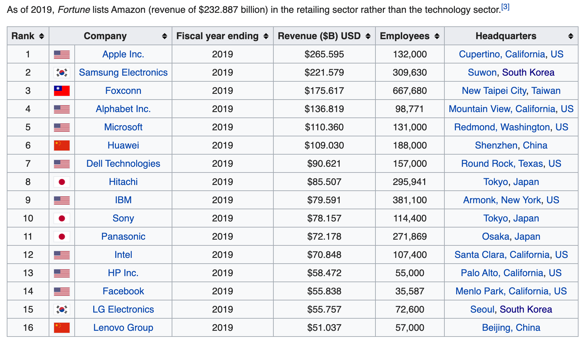
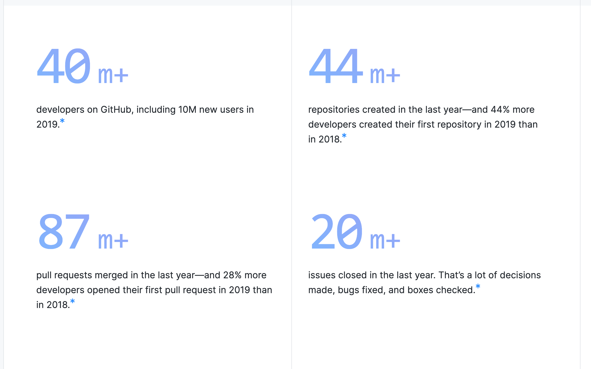
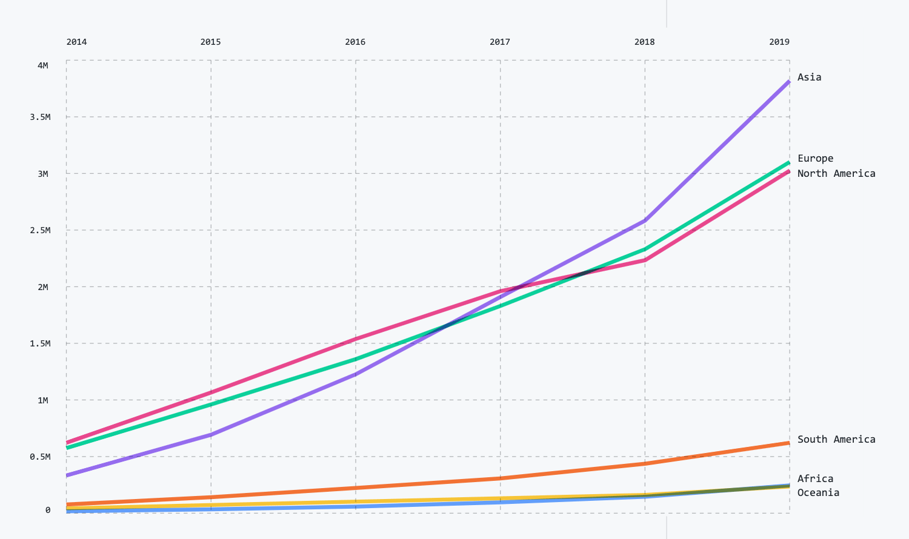
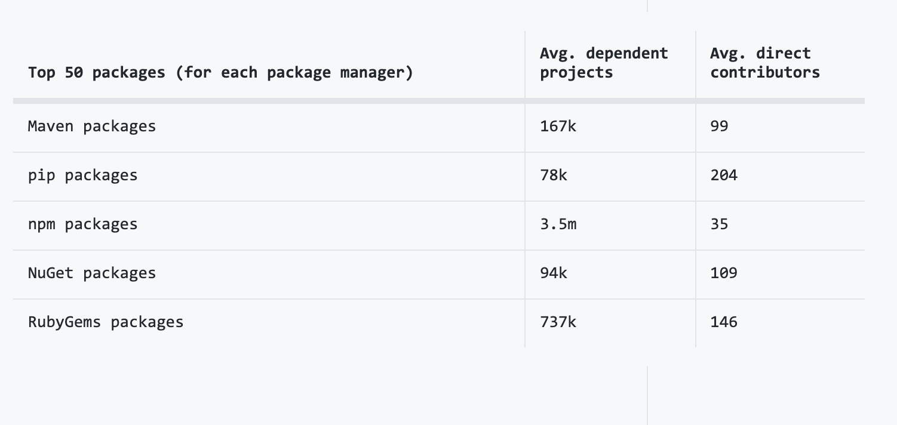
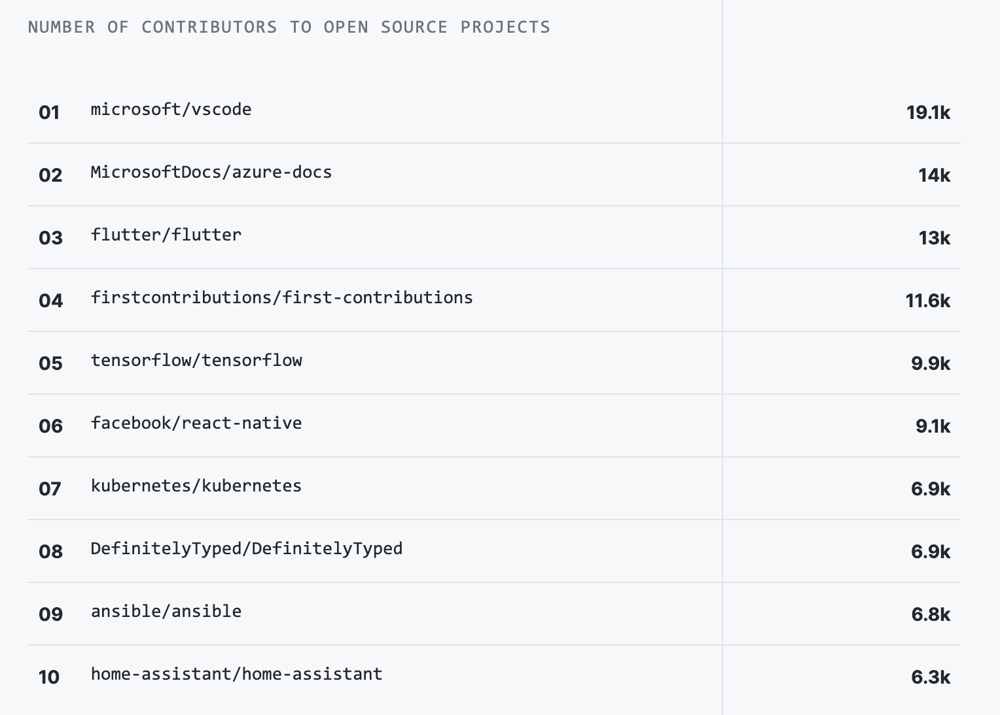
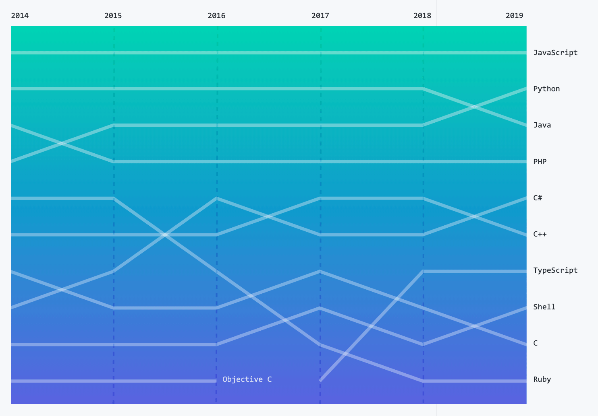
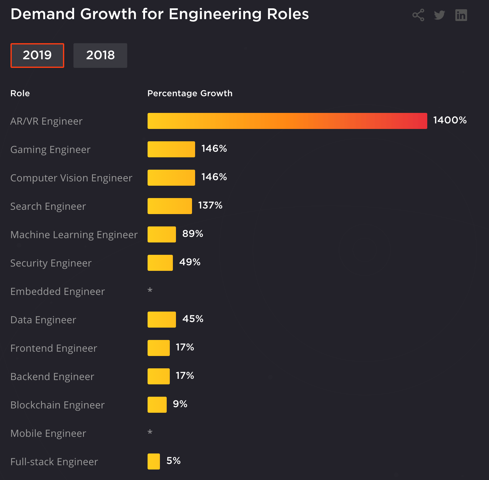

# State of Software Engineering in 2020
It is time to talk about the state of software engineering in 2020 and beyond. This article uses GitHub Octoverse data as the basis, plus my experiences and observations as a software engineer with a decade of experience. I will also talk about the topics listed below.

Table of contents:
* Overview
* Growth of Programming
* Growth of Open-Source
* Top Libraries
* Trending Projects
* Top Programming Languages
* Data Science and Machine Learning
* Cloud Computing, DevOps, and Security
* Conclusion

## Resources
You can find the video narration of this article on YouTube with illustrations: [https://www.youtube.com/watch?v=GesAhP5jYLo](https://www.youtube.com/watch?v=GesAhP5jYLo){:target="_blank"}

<iframe width="560" height="315" src="https://www.youtube.com/embed/GesAhP5jYLo" frameborder="0" allow="accelerometer; autoplay; encrypted-media; gyroscope; picture-in-picture" allowfullscreen></iframe>

Video has additional tips and illustrations. If you want to read the comments or leave a comment, do so under the YouTube video. If you want to contribute to the article, make a pull request on GitHub.

Resources referenced in this article:
* [GitHub Octoverse](https://octoverse.github.com){:target="_blank"}
* [Wikipedia: List of largest technology companies by revenue](https://en.wikipedia.org/wiki/List_of_largest_technology_companies_by_revenue){:target="_blank"}
* [Stack Overflow Annual Developer Survey](https://insights.stackoverflow.com/survey){:target="_blank"}
* [Hired: State of Software Engineers](https://hired.com/state-of-software-engineers){:target="_blank"}

My articles referred to in this article:
* [How to Correctly Use GitHub for Software Development - My Full Dev Workflow](/articles/how-to-use-github){:target="_blank"}

Hacker News discussions on this article:
* [https://news.ycombinator.com/item?id=22803081](https://news.ycombinator.com/item?id=22803081){:target="_blank"}

## Overview
Software engineering has seen explosive growth over the last 20 years, and it seems to be keeping that momentum up. According to Fortune data, total revenue of top 15 technology companies in the world was a record 1.67 Trillion US Dollars in 2019, which is up 2% from 2018. There are more software companies than ever now.

In addition, existing non-software companies are introducing more software components into their products, anything from cars to washing machines. The future is software, but not all software is created equal. Identifying the most promising and fastest-growing areas of software can help you take off your career and projects. Investing in a growing area helps you to find a job easier and get paid better, and helps you in finding funding for your projects. So, let us not waste time and get right into it.

## Growth of Programming
10M new developers joined the GitHub in 2019. I assume most of the new users are coming from non-US territories, but this is still a huge number. Big respect to GitHub for scaling to such an extent with little to no problems.

These new developers contributed to 44M+ repositories from all countries around the world. 80% of all code commits were made from outside the US. Again, the tech industry is growing very fast outside of the US too, and the GitHub data indicates that. Maybe within several decades, Silicon Valley will have multiple contenders for the first place as the world's center of software engineering.

On a side note, GitHub data does not represent the entire world, but it gives a pretty good idea of the general trend as it is the largest code hosting provider.

Almost 70% of Global Fortune 50 companies contributed to open-source in the last year. 70% contribution is huge, and according to GitHub, this is a growing number. Not only that, there were 2.9 million organization on GitHub last year, which sounds ridiculously large but as more and more companies introduce software components into their processes, even bigger numbers will become ordinary.

## Growth of Open-Source
On average, each open source project on GitHub had contributors from 41 different countries and regions. This again points to the pace of growth outside of the US.

After the United States, open source use picked up speed in China, India, and Germany. Developers in China forked and cloned 48% more projects than last year. I guess the growth of software in China is a surprise to no one. The question is not if it will overtake the United States, but when.

And if we look at things at a continent level, Asia is already ahead of the US and Europe. However, with their combined have a population of 1.6B, it is sad and somewhat surprising to see South America and Africa so far behind, having less than 1/3rd of contributions of Europe alone.

Tip: I have a dedicated article on how to correctly use GitHub for software development. In that article, I provide you with my full GitHub workflow, while getting some real work done on my android-docker open source project. I also have useful commentary and tips on efficient GitHub use. If you want to read it, the link is in the resources section above.

## Top Libraries
The top 50 open source packages in every programming language, including JavaScript, Python, Ruby, etc., have an overwhelming number of dependent projects. For instance, despite having an average of less than 40 direct contributors each, popular npm packages can be dependencies for millions of other repositories. It is no surprise that the top dependent packages are of Java, Python, and JavaScript. They are currently top 3 programming languages, and I do not expect it to change anytime soon.

## Trending Projects
As open-source is picking up more steam, contributions to open-source is also gaining momentum. I highly recommend contributing to open-source projects. It is an excellent opportunity to get into the open-source community and acquire invaluable experience. In addition, you can list projects that you created and contributed, in your resume, which is a great plus.

As you can see in the table, last year's most contributed projects were also amongst the most useful ones. For instance, Visual Studio Code is one of the best text editors for programming. Same goes for TensorFlow, React Native, and Kubernetes. They became invaluable tools, and it is no surprise that people like them and want to improve them with their contributions.

## Top Programming Languages
Now it is time to analyze the programming languages themselves. It is no shock that the programming language that is powering most of Web, JavaScript, is still number one. I expect Python to surpass JavaScript at some point, but we will have to wait and see exactly when. In fact, outside of GitHub, Python might already be #1 programming language. As always, Java is near the top along with PHP and C++.

What is surprising to me is the meteoric rise of TypeScript. I was predicting that once all good features of TypeScript end up in JavaScript itself, it would be discarded just like CoffeeScript and many others. Instead, only a handful of TypeScript features ended up in JavaScript, including private/static fields, optional chaining, and null coalescing. TypeScript kept its distinct identity and continues to power through. However, I still think that using plain modern JavaScript blows TypeScript out of the water with simplicity and cleanliness. TypeScript adds a great deal of complexity both tooling and dependencies (i.e. 3rd party type definition packages), and I do not think that it is worth it. On the other hand, I am not an oracle, so we will have to wait and see if it shares the same fate as CoffeeScript.

## Data Science and Machine Learning
2019 was the year of data science and machine learning. I fully expect it to continue in the same trajectory for almost the entirety of this decade. There is so much value in analyzing and understanding mass quantities of data. Especially coupled with machine learning, the value generated by these two will possibly outpace all other branches of computer science. I would say the only thing that can dethrone data science and ML would be a breakthrough in quantum computing. Otherwise, it is a good idea to invest some time into the hottest branch of computer science. As I always say, if you invest in a technology that is growing, you can grow with it.

Machine Learning is finding uses in every aspect of life. Predicting shopping behavior with ML and serving customized recommendations is one good example. Virtual personal assistants like Siri and Alexa, automated translation services like Google and Microsoft Translate, email spam filters, automated customer support, etc. are all becoming more and more ML-based.

## Cloud Computing, DevOps, and Security
Complexity and scale of software systems are increasing. In addition, specific tasks like machine learning require unconventional server hardware like TPUs, namely tensor processing units, which are custom-designed hardware to accelerate machine learning tasks. This results in an immense in-house effort to accommodate servers and maintain them manually. The most sensible way around this problem is using DevOps tools to automate the deployment and maintenance of your servers. It is also reasonable to move those servers to cloud providers so you will not ever have to see another bare-metal server again.

As the necessity for cloud hosting and DevOps increases, these skills are becoming increasingly desirable in the market. If you have the desire to work with hardware and networking, it would be a good investment to experiment with the cloud providers and DevOps tools. Most cloud providers hand out generous free tiers so you can create a free account on Google Cloud, Amazon Web Services, Azure, or any other smaller vendor and start experimenting and learning right away.

Obviously, moving all your data online has major security implications. This increases the need for security awareness for anyone working with DevOps or cloud. Besides, it also increases the need for dedicated software and network security engineers. Investing time in learning the security implications of your cloud and DevOps decisions is essential. If you plan to interview for a DevOps or any infrastructural position, you should expect a heavy emphasis on security.

## Conclusion
Software is moving fast, and it is fusing into all other areas of industry. As it is a growing field, learning to program and improving your skills in software engineering can have get you great returns in the future. Moreover, identifying the fastest growing areas of software and investing your time into them can get you to even better places. Keep learning and try to find opportunities that you can capitalize on or products that can serve a niche in a growing field of software. When that niche becomes mainstream, you can end up with a successful product in your hands, which can become your future success. If it fails, it will be an immense experience on the path to becoming a product person.

I will continue to put out software engineering and product making and management articles. If you want to be notified of when they are out, don't forget to follow me on social media. I will see you next time.
